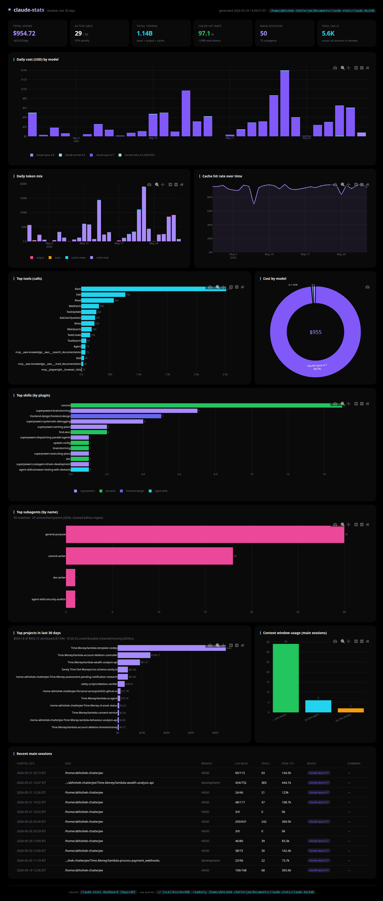
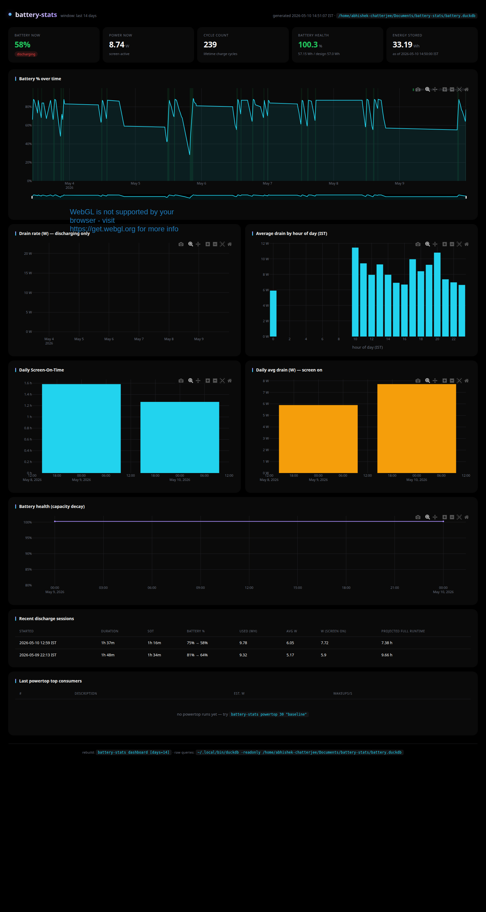

# pulse

> The heartbeat of your laptop and your AI workflow.

Two local analytics CLIs that turn your machine into a quantified-self setup —
no cloud, no telemetry, no subscriptions. Everything lives in DuckDB files on
your home directory; the dashboards are self-contained HTML files you open
straight from `/tmp`.

| | |
|---|---|
| **claude-stats** | Where your Claude Code spend goes. Cost by model, cache hit-rate, top tools, top skills (per plugin), top projects, context-window pressure. |
| **battery-stats** | Real Screen-On-Time, drain-rate, battery health, hourly drain heatmap, charging-period bands. |

Both share an AMOLED dark theme (true `#000000`, electric purple + cyan
accents) — easy on OLED panels, easy on the eyes.

---

## Dashboards

### claude-stats



```fish
claude-stats dashboard          # last 30 days, opens in browser
claude-stats dashboard 90       # last quarter
claude-stats dashboard 365      # last year
```

The dashboard is the surface — every metric is in there: cost stacked by
model, daily token mix, cache hit rate, top tools, top skills grouped by
plugin, top projects, context-window distribution. No terminal-table
fallbacks; the graphs say more in less space.

### battery-stats



```fish
battery-stats dashboard         # last 14 days, interactive HTML
battery-stats powertop 30       # capture 30s of top energy consumers
```

Same idea: SOT, drain rate, charging bands, sessions, hourly heatmap,
capacity decay — all in the dashboard.

### Internals

```fish
pulse-docs                      # open docs/index.html in browser
```

A self-contained HTML page (no external deps beyond Plotly's CDN) that
documents how every CLI subcommand and background pipeline works:
ingestion paths, the schema, the SOT integration trick, the UTC→IST
gotcha, the systemd timer migration. Lives at
[`docs/index.html`](docs/index.html). Designed to be the place future-you
goes to remember why something was done.

---

## Quick start

On a fresh laptop:

```bash
# HTTPS (no auth needed for clone)
git clone https://github.com/abhishek1337chatterjee/pulse.git ~/Documents/pulse
# or SSH if you have a key
# git clone git@github.com:abhishek1337chatterjee/pulse.git ~/Documents/pulse

cd ~/Documents/pulse
./install.sh
```

`install.sh` is idempotent — re-run it anytime after `git pull` and it'll just
re-link any new files. It:

1. Installs DuckDB into `~/.local/bin` if missing
2. Creates `~/Documents/{claude-stats,battery-stats}/` with empty databases
3. **Symlinks** every script + fish function + systemd unit from this repo into
   the live paths (so `git pull` instantly updates everything — no copy step)
4. Enables the battery-stats systemd timers (poll every 5 min, aggregate nightly 03:15)
5. Enables the claude-stats systemd timer (nightly 02:00, `Persistent=true` so missed runs fire on next boot)
6. Grants ACL read access on `/var/lib/upower/*.dat` (one sudo prompt)
7. Drops a `sudo-askpass` zenity helper for `battery-stats powertop`

After install:

```fish
exec fish                                        # re-source functions
claude-stats ingest && claude-stats ingest-sessions
battery-stats ingest                              # UPower bulk backfill
claude-stats dashboard
battery-stats dashboard
```

---

## What's stored where

```
~/Documents/claude-stats/
├── claude.duckdb              ← data (gitignored)
├── schema.sql                 → symlink to repo
├── bin/                       → symlinks to repo
└── cron.log                   ← nightly cron output

~/Documents/battery-stats/
├── battery.duckdb             ← data (gitignored)
├── schema.sql                 → symlink to repo
└── bin/                       → symlinks to repo

~/.config/fish/functions/
├── claude-stats.fish          → symlink to repo
├── battery-stats.fish         → symlink to repo
└── pulse-docs.fish            → symlink to repo  (opens docs/index.html)

~/.config/systemd/user/
├── battery-stats-poll.service       → symlink to repo
├── battery-stats-poll.timer         → symlink to repo
├── battery-stats-aggregate.service  → symlink to repo
├── battery-stats-aggregate.timer    → symlink to repo
├── claude-stats-ingest.service      → symlink to repo
└── claude-stats-ingest.timer        → symlink to repo
```

DuckDB files live **outside** the repo so they survive `claude-clean` and
aren't tracked in git.

---

## How each piece works

### claude-stats

| File | Role |
|---|---|
| `claude-stats/bin/ingest-daily.sh` | runs `npx ccusage daily --json` twice (plain + `--instances --breakdown`), upserts into `daily_usage` (PK: `date,model`) and `project_daily_usage` (PK: `project_path,date,model`). Both share an 8-day rolling-rewrite window so older rows are immutable; `project_daily_usage` rolled up sums to `daily_usage` to the cent. |
| `claude-stats/bin/ingest-sessions.py` | walks `~/.claude/projects/**/*.jsonl`, parses tool-use events + usage, writes `conversations`, `conversation_tool_usage`, `conversation_skill_usage`. Also writes legacy `project_usage` from `ccusage session --json` (lifetime per-project totals; no panel reads from it — kept for now). |
| `claude-stats/bin/cleanup-old.sh` | 365-day retention across all six data tables |
| `claude-stats/bin/build-dashboard.sh` | emits self-contained `/tmp/claude-stats-dashboard.html` (Plotly via CDN, AMOLED theme) |
| `claude-stats/fish/claude-stats.fish` | CLI wrapper: `dashboard` (interactive HTML), `ingest`, `ingest-sessions`, `raw <SQL>` (debug-only escape hatch) |

Schedule: **systemd user timer** `claude-stats-ingest.timer` runs nightly
at 02:00 (with `Persistent=true`, so missed runs from off/asleep nights
fire on next boot) — chains ingest-daily → ingest-sessions → cleanup-old.
Also: `claude-clean` runs ingest-sessions *before* per-project deletion to
capture conversation metadata before the JSONLs are deleted.

### battery-stats

| File | Role |
|---|---|
| `battery-stats/bin/poll.sh` | every 5 min: reads `/sys/class/power_supply/BAT0/*` + Wayland screen state (`loginctl IdleHint` + `gdbus org.gnome.ScreenSaver.GetActive`); writes one row to `battery_samples`; flock'd-runs the aggregator |
| `battery-stats/bin/ingest-upower.sh` | bulk-imports UPower's `/var/lib/upower/history-{rate,charge}-{MODEL}-*.dat` (TSV: epoch, value, state) — auto-detects `MODEL` from `/sys/class/power_supply/BAT0/model_name`. Override with `BATTERY_MODEL=…` env var. |
| `battery-stats/bin/aggregate-daily.sh` | derives `discharge_sessions` (one per AC-off→AC-on transition) and `daily_battery` (IST date rollup). SOT = sum of intervals where `screen_active=true`. |
| `battery-stats/bin/powertop-capture.sh` | manual `sudo -A powertop --csv ...` run; parses Top 10 Power Consumers; uses `SUDO_ASKPASS=$HOME/.local/bin/sudo-askpass` (zenity GUI prompt) |
| `battery-stats/bin/cleanup-old.sh` | 90-day retention on raw samples (configurable: `BATTERY_STATS_RETENTION_DAYS=…`); `daily_battery` + `discharge_sessions` kept indefinitely (tiny) |
| `battery-stats/bin/build-dashboard.sh` | emits `/tmp/battery-stats-dashboard.html` |
| `battery-stats/fish/battery-stats.fish` | CLI wrapper: `dashboard`, `powertop` / `powertop-show`, `ingest`, `aggregate`, `poll` |

Schedule: **systemd user timers** — poll every 5 min, aggregate nightly 03:15.

---

## Dependencies

System packages (Ubuntu 24.04+):

```bash
sudo apt install fish jq awk python3 curl unzip \
                 google-chrome-stable \
                 powertop zenity acl
# Wayland screen-state detection:
#   loginctl + gdbus come from systemd / glib2 (already on GNOME)
```

User-space:

- **DuckDB** CLI — `install.sh` fetches the latest amd64 binary into `~/.local/bin`
- **ccusage** — pulled on demand via `npx ccusage@latest` (needs node in `$PATH`)
- **gh** (optional) — only needed if you want to clone via SSH or push back

Hardware assumptions:

- Single internal battery exposed at `/sys/class/power_supply/BAT0/`
- UPower running and writing to `/var/lib/upower/`
- Wayland session (X11 will work but `loginctl IdleHint` doesn't update there)

---

## Timezone

All timestamps are stored as **UTC** (`poll.sh` uses `date -u`). Display
conversion to IST happens in the dashboard SQL via:

```sql
STRFTIME((ts AT TIME ZONE 'UTC') AT TIME ZONE 'Asia/Kolkata', '%H:%M:%S')
```

The double `AT TIME ZONE` is deliberate — DuckDB's first form ("treat naive
TIMESTAMP as zone X") rebadges the value, the second form ("convert
TIMESTAMPTZ to zone X") does the actual offset shift. To localise to a
different zone, swap `'Asia/Kolkata'` everywhere (the `build-dashboard.sh` and
`aggregate-daily.sh` files are the only sites).

---

## Updating

```bash
cd ~/Documents/pulse
git pull
./install.sh   # idempotent — applies any new schema migrations + relinks new files
```

If a script was added in the new commit, `install.sh` symlinks it. If a script
was renamed, the old symlink becomes a dangling pointer — `install.sh` doesn't
remove dangling links yet (delete them by hand or rerun after `find -L … -type l ! -exec test -e {} \; -delete`).

---

## Uninstall

```bash
# stop the background work
systemctl --user disable --now battery-stats-poll.timer battery-stats-aggregate.timer claude-stats-ingest.timer

# remove symlinks (this script's job, but doable by hand)
find ~/.config/fish/functions -lname '*pulse*' -delete
find ~/.config/systemd/user   -lname '*pulse*' -delete
find ~/Documents/{claude,battery}-stats -lname '*pulse*' -delete

# data is yours: keep or rm
rm -ri ~/Documents/{claude,battery}-stats
```

---

## License

MIT, but honestly, this is personal tooling — fork it, rewrite it, ignore it.
